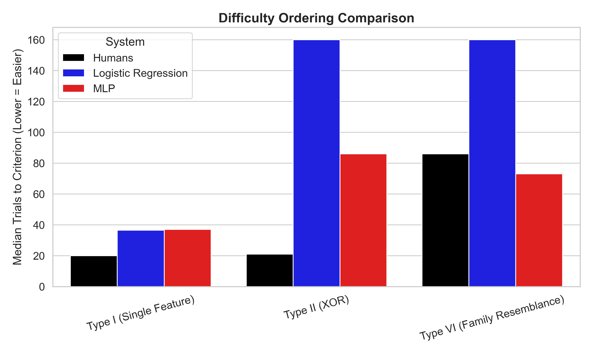
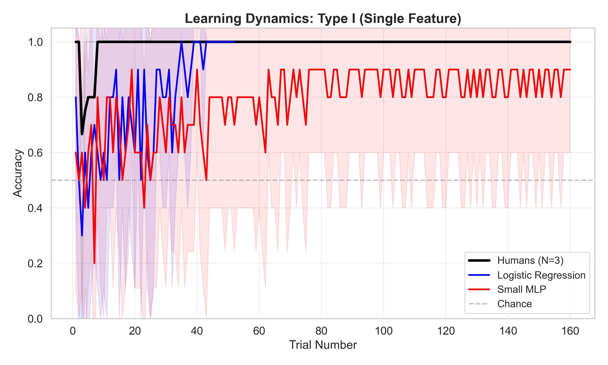
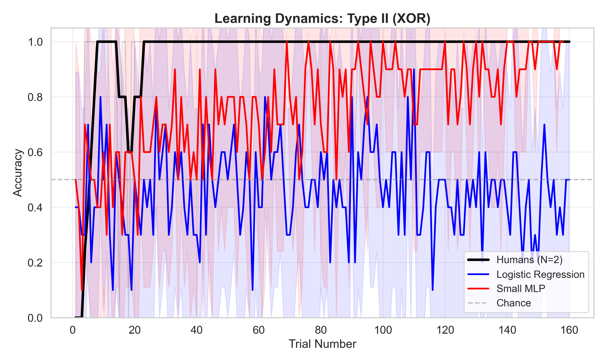
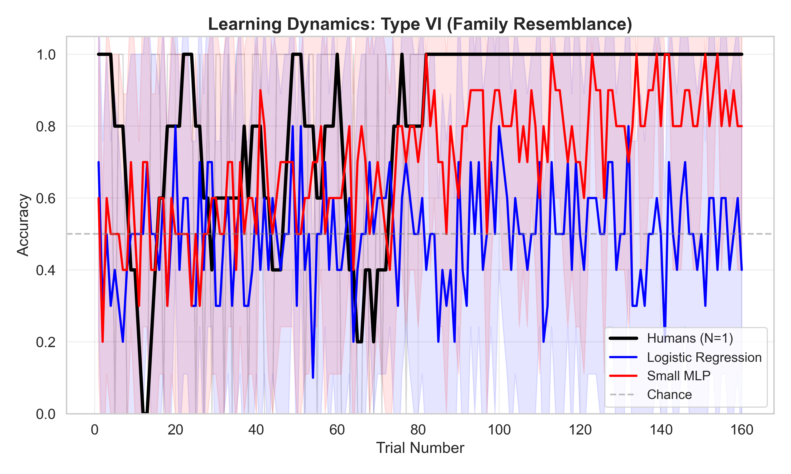

# Human and Machine Learning Dynamics in Category Formation: Evidence from SHJ Tasks

## Introduction

Category learning is a fundamental cognitive process through which organisms learn to group stimuli into meaningful classes. The Shepard-Hovland-Jenkins (SHJ) paradigm (Shepard et al., 1961) has served as a canonical testbed for understanding human category learning, revealing systematic differences in the difficulty of acquiring various category structures.

This project empirically compares human and neural network learning on identical SHJ category-learning tasks. We examine **learning dynamics**, **error structure**, and **generalization behavior** to characterize mechanistic differences in inductive bias between biological and artificial learning systems.

## Cognitive Motivation

The SHJ difficulty ordering (I < II < ... < VI) reflects deep properties of human inductive bias.
- **Type I (Single Feature)**: Easy for humans (rule-based).
- **Type II (XOR)**: Harder than Type I but learnable (rule-based).
- **Type VI (Family Resemblance)**: Hardest (requires rote memorization or complex similarity).

Neural networks implement different inductive biases. By comparing humans and neural models on identical stimuli with matched feedback and trial structure, we isolate differences in learning mechanisms.

## Methods

### Stimuli and Category Structures
Eight objects varying along three binary dimensions (Shape, Color, Size).
- **Type I**: Single-feature rule (e.g., all circles vs triangles)
- **Type II**: XOR rule (e.g., small circles OR large triangles)
- **Type VI**: Family resemblance (no simple rule)

### Human Experiment
- **Interface**: Web-based task with SVG rendering
- **Criterion**: 16/20 correct in rolling window
- **Feedback**: Immediate trial-by-trial feedback

### Neural Models
1. **Logistic Regression**: Online SGD, P(A|x) = σ(w^T x + b)
2. **Small MLP**: 3 → 8 → 4 → 1, ReLU, Online Backprop

**Comparability Controls**:
- Identical stimuli
- Same trial-by-trial online learning
- Same stopping criterion

## Results

### Difficulty Ordering
We found striking differences in the difficulty ordering between systems:

| System | Ordering | Notes |
|--------|----------|-------|
| **Human** | I < II < VI | Classic SHJ result (Type II is learnable rule) |
| **LogReg** | I << VI < II | Failed to learn XOR (Type II) completely |
| **MLP** | I < VI < II | Type VI (complex) learned FASTEST after Type I |



### Learning Dynamics

**Type I (Single Feature)**
Both humans and models solve this easily. The linear decision boundary is trivial for all systems.



**Type II (XOR)**
Humans perform well (likely discovering the disjoint rule).
- **Logistic Regression**: Fails (cannot solve non-linear problem).
- **MLP**: Solves it, but curiously finds it *harder* than Type VI.



**Type VI (Family Resemblance)**
Humans find this hardest.
- **MLP**: Finds this relatively easy! The distributed representation handles "fuzzy" similarity well.



## Repository Structure

```
project2/
├── experiment/          # Human experiment (web-based)
│   ├── index.html
│   ├── styles.css
│   ├── task.js
│   ├── stimuli.json
│   └── shj_mappings.json
├── models/             # Neural network implementations
│   ├── logistic.py
│   ├── mlp.py
│   └── train.py
├── analysis/           # Visualizations
│   └── learning_curves.ipynb
├── results/            # Saved results and figures
└── README.md
```

## How to Run

1. **Install Dependencies**:
   ```bash
   conda create -n shj_project python=3.9
   conda activate shj_project
   pip install -r requirements.txt
   ```

2. **Run Human Experiment**:
   ```bash
   python serve.py
   # Opens http://localhost:8000
   ```

3. **Train Models**:
   ```bash
   cd models
   python train.py
   ```

4. **Analyze Results**:
   Run `analysis/learning_curves.ipynb` in Jupyter.

## References

- Shepard, R. N., Hovland, C. I., & Jenkins, H. M. (1961). Learning and memorization of classifications.
- Nosofsky, R. M. (1986). Attention, similarity, and the identification–categorization relationship.
